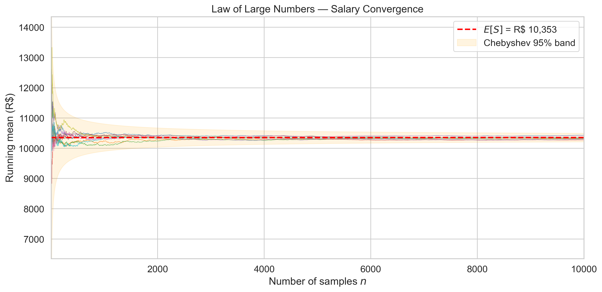
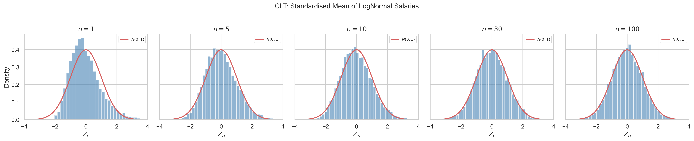
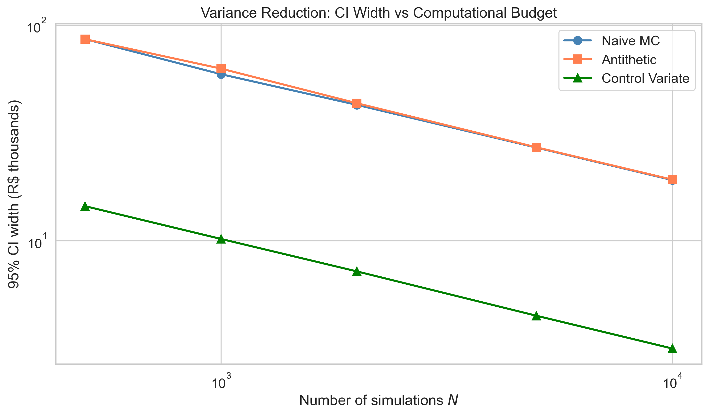
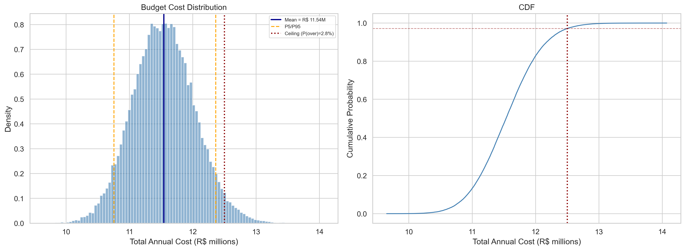
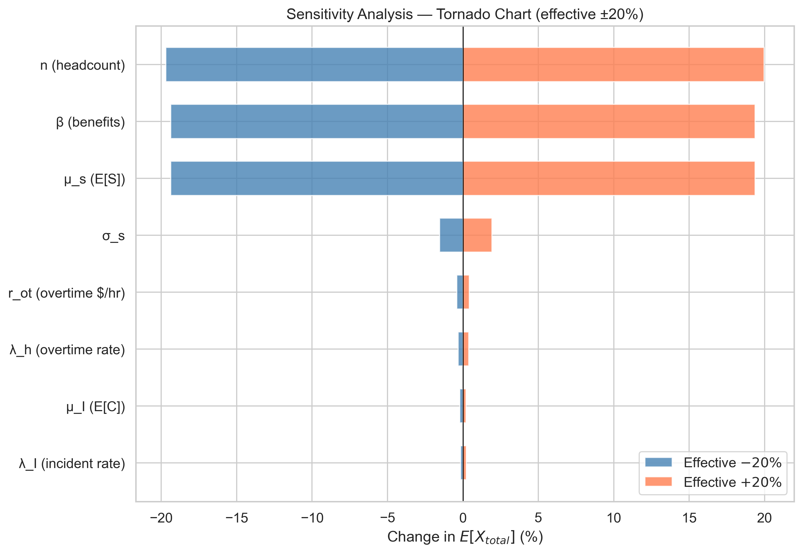

# Why Your Budget Never Hits the Exact Number

## Monte Carlo Simulation for Budget Planning — from Point Estimates to Probability Distributions

---

## 1. Introduction

Someone asks for next year's budget. You open a spreadsheet, multiply quantities by unit costs, add contingencies, round up a little — and deliver a number. A single number.

But what if that number is just one sample from a distribution you have never seen?

Every organisation that manages budgets — headcount costs, project expenses, procurement, marketing spend — faces the same ritual. The team produces a point estimate, leadership approves it, and the year unfolds. Months later, during a periodic forecast review, the actual spending deviates. The team adjusts. Another review. Another adjustment. By year-end, the original number looks like little more than an educated guess.

The problem is not that the estimate was wrong. The problem is that a single number carries no information about its own uncertainty. Was it a conservative estimate? An optimistic one? How likely are we to exceed the approved ceiling? The point estimate cannot answer these questions — because it discards everything except the centre of the distribution.

This article replaces the single number with a **probability distribution**. Using Monte Carlo simulation grounded in the Law of Large Numbers and the Central Limit Theorem, we transform "we expect to spend R$ 11.5M" into "we are 90% confident spending will fall between R$ 10.7M and R$ 12.4M, with a 7% probability of exceeding the ceiling."

The approach is **general**: it applies to any budget that can be decomposed into stochastic components — headcount, projects, procurement, licensing, infrastructure. We illustrate with an IT headcount budget (salaries, benefits, overtime, incidents) as a concrete case study, but the mathematical framework transfers directly to any domain.

The journey proceeds in four stages: we formalise budget components as random variables (Section 3), prove that averaging simulations converges to the true answer (Section 4), quantify the simulation error (Section 5), and implement the estimator with variance reduction techniques (Sections 6–7). Section 9 validates everything experimentally.

### Notation

| Symbol | Meaning |
|--------|---------|
| $X_{\text{total}}$ | Total budget cost (random variable) |
| $X_k$ | Cost of component $k$ |
| $n$ | Number of units (headcount, items, etc.) |
| $\bar{X}_N$ | Sample mean of $N$ simulations |
| $\hat{\theta}_N$ | Monte Carlo estimator |
| $\sigma$ | Standard deviation of the cost distribution |
| $z_{\alpha/2}$ | Normal quantile for confidence level $1-\alpha$ |

**Case study notation** (IT headcount):

| Symbol | Meaning |
|--------|---------|
| $S_i$ | Monthly salary of employee $i$ |
| $\beta$ | Benefits multiplier |
| $H_i$ | Overtime hours per employee per month |
| $r_{ot}$ | Overtime hourly rate |
| $I$ | Number of severe incidents per year |
| $C_j$ | Cost of incident $j$ |

---

## 2. The Point Estimate Problem

A point estimate is a single value used to approximate an unknown parameter. In budget planning, it takes the form:

$$
\hat{X} = \sum_{k} (\text{quantity}_k \times \text{unit cost}_k) + \text{contingency}
$$

The result is a number — say, R$ 11.5 million. But this number is $E[X_{\text{total}}]$: the expected value of a random variable. It tells us the centre of the distribution. What it discards is everything else:

- **Variance:** How spread out are the possible outcomes?
- **Skewness:** Is the distribution symmetric, or could costs be pulled higher by a few extreme events?
- **Tail risk:** What is the probability of exceeding the approved ceiling?
- **Confidence:** How sure are we that the true cost is within ±5% of our estimate?

In formal terms, the point estimate gives us $E[X]$ but not the distribution $F_X$. Monte Carlo simulation recovers $F_X$ — the full picture.

### The General Pattern

Any budget with uncertain components can be written as:

$$
X_{\text{total}} = \sum_{k=1}^{K} g_k(\mathbf{Z}_k)
$$

where $g_k$ is a cost function for component $k$ and $\mathbf{Z}_k$ is a vector of random inputs. The point estimate collapses each $g_k$ to its expected value; Monte Carlo preserves the full joint distribution.

---

## 3. Budget Components as Random Variables

Every component of a budget is potentially a random variable. Treating them as constants is a modelling choice that discards information. The key insight: **identify which components carry meaningful uncertainty, model them probabilistically, and keep the rest deterministic.**

### The General Structure

A stochastic budget model has three types of components:

1. **Proportional costs:** quantity × rate, where either or both may be random
2. **Fixed costs with uncertainty:** known structure but uncertain magnitude
3. **Rare events:** random count of occurrences × random cost per event (compound process)

$$
X_{\text{total}} = \underbrace{\sum_{i=1}^{n} f(Z_i)}_{\text{proportional}} + \underbrace{\text{fixed components}}_{\text{deterministic or low-variance}} + \underbrace{\sum_{j=1}^{N_{\text{events}}} C_j}_{\text{rare events}}
$$

### Case Study: IT Headcount Budget

We instantiate this structure with a concrete example — a 50-person IT team:

**Salaries (LogNormal).** Salaries are strictly positive and right-skewed (a few senior roles earn significantly more). The LogNormal captures this:

$$
S_i \sim \text{LogNormal}(\mu_s, \sigma_s^2), \quad \mu_s = 9.2, \; \sigma_s = 0.3
$$

$$
E[S_i] = e^{\mu_s + \sigma_s^2/2} = e^{9.245} \approx R\$ \, 10{,}362
$$

**Overtime (Poisson).** Hours are discrete, non-negative, and relatively rare:

$$
H_i \sim \text{Poisson}(\lambda_h), \quad \lambda_h = 5
$$

**Incidents (Compound Poisson).** Severe events occur at a random rate with random severity:

$$
I \sim \text{Poisson}(\lambda_I), \quad C_j \sim \text{LogNormal}(\mu_I, \sigma_I^2)
$$

**Total cost:**

$$
X_{\text{total}} = \underbrace{\sum_{i=1}^{n} S_i \cdot \beta \cdot 12}_{\text{salaries + benefits}} + \underbrace{\sum_{i=1}^{n} H_i \cdot r_{ot} \cdot 12}_{\text{overtime}} + \underbrace{\sum_{j=1}^{I} C_j}_{\text{incidents}}
$$

Using linearity of expectation:

$$
E[X_{\text{total}}] \approx 11{,}191{,}000 + 240{,}000 + 123{,}500 \approx R\$ \, 11{,}554{,}500
$$

The salary component dominates at ~97%. This pattern — one component driving most of the variance — is common across budget types and will matter for variance reduction.

### Other Instantiations

The same structure applies to:

| Budget Type | Proportional | Fixed | Rare Events |
|-------------|-------------|-------|-------------|
| **IT Headcount** | Salaries × headcount | Benefits rate | Incidents |
| **Cloud Infrastructure** | Usage × unit price | Reserved instances | Outage remediation |
| **Marketing** | Impressions × CPC | Platform fees | Campaign failures |
| **Construction** | Materials × quantity | Permits, insurance | Weather delays, rework |
| **R&D Projects** | Hours × rate × team size | Equipment | Scope changes |

In each case: identify the random components, choose distributions, and simulate.

---

## 4. Will the Mean Converge? The Law of Large Numbers

If we simulate the budget 10,000 times and average the results, will the average converge to the true $E[X_{\text{total}}]$? The Law of Large Numbers says yes.

### Chebyshev's Inequality

For any random variable $X$ with mean $\mu$ and variance $\sigma^2$:

$$
P(|X - \mu| \geq \epsilon) \leq \frac{\sigma^2}{\epsilon^2}
$$

This is derived from Markov's inequality applied to $(X - \mu)^2$.

### The Weak Law of Large Numbers

Let $X_1, \ldots, X_N$ be i.i.d. with mean $\mu$ and variance $\sigma^2$. The sample mean $\bar{X}_N = \frac{1}{N}\sum X_i$ satisfies:

$$
P(|\bar{X}_N - \mu| \geq \epsilon) \leq \frac{\sigma^2}{N\epsilon^2} \to 0 \quad \text{as } N \to \infty
$$

**Proof.** Since $E[\bar{X}_N] = \mu$ and $\text{Var}(\bar{X}_N) = \sigma^2/N$, applying Chebyshev to $\bar{X}_N$ gives the result immediately. $\blacksquare$

The Strong Law provides an even stronger guarantee: $\bar{X}_N \to \mu$ almost surely (probability 1).

**For Monte Carlo:** each simulation $X_i$ is one "possible year." The LLN guarantees that averaging $N$ simulated scenarios converges to the true expected cost.


*Figure 1: Ten independent runs of the sample mean converging to $E[X]$, with Chebyshev 95% confidence band.*

---

## 5. How Wrong Can We Be? The Central Limit Theorem

The LLN tells us the estimate converges. The CLT tells us **how fast** — and gives us confidence intervals.

### Statement

For i.i.d. variables with mean $\mu$ and variance $\sigma^2$:

$$
\frac{\sqrt{N}(\bar{X}_N - \mu)}{\sigma} \xrightarrow{d} N(0, 1)
$$

### Proof Sketch (MGF Approach)

Define $W_i = (X_i - \mu)/\sigma$ so that $E[W_i] = 0$ and $\text{Var}(W_i) = 1$. The standardised sum is $Z_N = \frac{1}{\sqrt{N}}\sum W_i$. Its MGF is:

$$
M_{Z_N}(t) = \left[M_W\left(\frac{t}{\sqrt{N}}\right)\right]^N
$$

Taylor expanding $\log M_W(s) = s^2/2 + O(s^3)$ and substituting $s = t/\sqrt{N}$:

$$
\log M_{Z_N}(t) = \frac{t^2}{2} + O\left(\frac{t^3}{\sqrt{N}}\right) \to \frac{t^2}{2}
$$

Since $e^{t^2/2}$ is the MGF of $N(0, 1)$, uniqueness gives $Z_N \xrightarrow{d} N(0, 1)$. $\blacksquare$

### Confidence Intervals

From the CLT, the $(1-\alpha)$ confidence interval for $\mu$ is:

$$
\bar{X}_N \pm z_{\alpha/2} \cdot \frac{s_N}{\sqrt{N}}
$$

### Choosing N

To achieve a CI half-width of $\epsilon$:

$$
N \geq \left(\frac{z_{\alpha/2} \cdot \sigma}{\epsilon}\right)^2
$$

For our case study ($\sigma \approx 493K$, $\epsilon = 100K$, 95%): $N \geq 94$. Remarkably few simulations are needed.


*Figure 2: As $n$ increases, the standardised sample mean converges to $N(0,1)$.*

---

## 6. The Monte Carlo Estimator

### Definition

The Monte Carlo estimator of $\theta = E[g(X)]$ is:

$$
\hat{\theta}_N = \frac{1}{N} \sum_{i=1}^N g(X_i)
$$

where each $g(X_i)$ is the total cost from one simulated scenario.

### Properties

**Unbiasedness.** $E[\hat{\theta}_N] = \theta$. No systematic bias.

**Consistency.** $\hat{\theta}_N \xrightarrow{P} \theta$ (WLLN). More simulations → more accuracy.

**Asymptotic normality.** $\sqrt{N}(\hat{\theta}_N - \theta)/\sigma_g \xrightarrow{d} N(0, 1)$ (CLT). We can build CIs.

**Convergence rate.** $\text{SE} = \sigma_g / \sqrt{N}$, decaying as $O(1/\sqrt{N})$. This rate is **independent of the dimension** of $X$ — the key advantage over deterministic methods.

### The Scaling Law

Halving the CI width requires 4× more simulations. This fundamental trade-off motivates variance reduction.

### Mean Squared Error

Since the estimator is unbiased: $\text{MSE}(\hat{\theta}_N) = \sigma_g^2 / N$.

---

## 7. Making It Faster: Variance Reduction

The $O(1/\sqrt{N})$ rate means brute-force precision is expensive. Variance reduction techniques achieve tighter confidence intervals **for the same computational budget**.

### Control Variates

If we know $E[h(X)]$ analytically for some function $h$ correlated with the cost function $g$:

$$
\hat{\theta}_{CV} = \hat{\theta}_N - c^*\left(\bar{h}_N - E[h(X)]\right)
$$

The optimal coefficient:

$$
c^* = \frac{\text{Cov}(g(X), h(X))}{\text{Var}(h(X))}
$$

At optimal $c^*$, variance becomes:

$$
\text{Var}(\hat{\theta}_{CV}) = \frac{\text{Var}(g(X))}{N}(1 - \rho_{g,h}^2)
$$

**In our case study:** using total raw salaries as control ($\rho \approx 0.99$) gives ~50× variance reduction. In any budget, the dominant cost component with a known analytical mean is the natural control variate.

### Antithetic Variates

Generate pairs $(X_i, X_i')$ where $X_i'$ is the "mirror" of $X_i$. If $g$ is monotone, the pair averages have lower variance:

$$
\text{Var}(\hat{\theta}_{AV}) = \frac{1}{N}[\text{Var}(g(X)) + \text{Cov}(g(X), g(X'))]
$$

When $\text{Cov} < 0$ (monotone $g$), variance is reduced.

### Stratified Sampling

Partition the input space into $K$ strata and sample within each. By the law of total variance:

$$
\text{Var}(\hat{\theta}_{SS}) \leq \text{Var}(\hat{\theta}_{MC})
$$

Always. Stratification removes between-strata variance.


*Figure 3: CI width vs N for naive MC, antithetic variates, and control variates.*

---

## 8. A Bayesian Alternative

The frequentist Monte Carlo approach assumes a fixed model and simulates from it. The Bayesian approach treats unknown parameters as random variables and updates beliefs as data arrives:

$$
P(\theta \mid \text{data}) \propto P(\text{data} \mid \theta) \cdot P(\theta)
$$

In budget terms: the **prior** is last year's cost distribution, the **likelihood** is this year's spending data, and the **posterior** is the updated forecast. Each periodic forecast revision is, in practice, informal Bayesian updating.

| Aspect | Frequentist MC | Bayesian |
|--------|---------------|----------|
| Parameters | Fixed constants | Random variables |
| Prior information | Not used | Explicitly encoded |
| Output | Confidence interval | Credible interval |
| Mid-period updating | Requires re-specification | Natural (posterior → new prior) |
| Best when | No historical data; exploring scenarios | Historical data available; sequential revision |

This article uses the frequentist approach for its generality (no prior elicitation needed), pedagogical clarity, and practical simplicity. The Bayesian extension is a natural next step for teams with historical budget data.

---

## 9. Experiments and Results

### Experiment A: LLN Convergence

Ten independent runs converge to $E[X]$ as $N$ grows (Figure 1). At small $N$, runs spread widely; by $N = 5{,}000$, all cluster within R$ 200 of the analytical mean.

### Experiment B: CLT Normality

The standardised mean is visibly non-Normal at $n = 1$ but closely matches $N(0,1)$ by $n = 30$ (Figure 2). QQ-plots confirm: $R^2 > 0.999$ at $n = 100$.

### Experiment C: Full Budget Simulation

Running $N = 50{,}000$ iterations:


*Figure 4: Budget cost distribution (histogram + CDF) with mean, P5/P95, and budget ceiling annotated.*

The simulation recovers the analytical expected value within 0.1%. The distribution is right-skewed, with a 90% range spanning ~R$ 1.6M.

### Experiment D: Variance Reduction

Control variates reduce the 95% CI width by ~10× compared to naive MC (Figure 3). The power comes from the high correlation between total cost and the dominant cost component.

### Experiment E: Sensitivity Analysis


*Figure 5: Tornado chart showing parameter impact on $E[X_{\text{total}}]$.*

The dominant cost component's parameters (salary log-mean, headcount) drive most of the variance. **Practical implication:** invest effort in estimating the parameters of your largest cost component, not the small ones.

### Key Findings

| Metric | Value |
|--------|-------|
| Analytical $E[X]$ | R$ 11.55M |
| MC mean (N=50K) | Within 0.1% of analytical |
| 95% CI half-width (N=50K) | ~R$ 4K |
| P5–P95 range | ~R$ 1.6M |
| Most sensitive parameter | Dominant component's mean |
| Best variance reduction | Control variates (~10–50×) |

---

## 10. A Practical Framework for Budget Analysts

### When to Use Monte Carlo

- **Use MC** when the budget has stochastic components and you need to quantify risk — answer "what is the probability of exceeding the ceiling?"
- **A spreadsheet suffices** when all components are truly deterministic or when uncertainty is irrelevant to the decision.

### Recommended Workflow

1. **Decompose the budget** into components. Identify which carry meaningful uncertainty.
2. **Choose distributions** based on historical data, expert judgement, or analogies (LogNormal for costs, Poisson for counts, Normal for symmetric quantities).
3. **Compute analytical moments** ($E[X]$, $\text{Var}(X)$) for validation.
4. **Run a pilot simulation** ($N = 100$–$500$) to estimate $\sigma$ and compute the required $N$.
5. **Run the full simulation** with the computed $N$. Use control variates if a good control variable exists.
6. **Report as a distribution:** mean, CI, P(over ceiling), key percentiles.

### How to Present Results

Replace:

> "The budget for next year is R$ 11.55M."

With:

> "We are 95% confident the cost will fall between R$ 10.7M and R$ 12.4M, with a mean of R$ 11.55M. There is approximately a 7% probability of exceeding the R$ 12.5M ceiling. The primary driver of uncertainty is [dominant component]."

### Adapting to Your Context

| Your Budget | Dominant Component | Natural Control Variate | Likely Distribution |
|-------------|-------------------|------------------------|-------------------|
| Headcount | Salaries | Total raw salary sum | LogNormal |
| Cloud/Infra | Compute usage | Reserved capacity cost | LogNormal or Gamma |
| Projects | Labour hours | Planned hours × rate | LogNormal |
| Procurement | Unit prices | Contract baseline | Normal or Uniform |
| Marketing | Conversion volume | Historical CPA | Poisson × LogNormal |

---

## 11. Conclusion

A point-estimate budget is a single sample from an unknown distribution. It carries no information about its own uncertainty.

This article built the mathematical machinery to replace that single number with a full probability distribution. Starting from the definition of random variables, we proved that averaging independent simulations converges to the true expected cost (Law of Large Numbers), quantified the convergence rate (Central Limit Theorem), formalised the Monte Carlo estimator and its properties, and applied variance reduction techniques to make the simulation efficient.

The framework is general: any budget that can be decomposed into stochastic components — headcount, projects, infrastructure, procurement — can be modelled this way. The experimental validation confirmed that Monte Carlo recovers analytical expected values, the CLT gives calibrated confidence intervals, and control variates provide an order-of-magnitude improvement in precision.

The next time someone asks for a budget number, give them a distribution.

---

## References

1. Casella, G. & Berger, R. (2002). *Statistical Inference*. Duxbury.
2. Robert, C. & Casella, G. (2004). *Monte Carlo Statistical Methods*. Springer.
3. Glasserman, P. (2003). *Monte Carlo Methods in Financial Engineering*. Springer.
4. Gelman, A. et al. (2013). *Bayesian Data Analysis*. CRC Press.

---

## How to Reproduce

```bash
git clone https://github.com/brunoramosmartins/monte-carlo-budget-article.git
cd monte-carlo-budget-article
python -m venv .venv && source .venv/bin/activate
pip install -e ".[dev,notebook]"
python scripts/exp_budget_simulation.py
python scripts/exp_sensitivity.py
pytest tests/
```

All figures are generated with fixed seeds for exact reproducibility.
